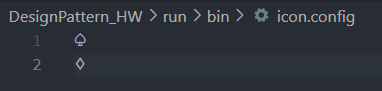
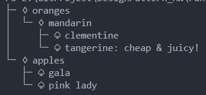
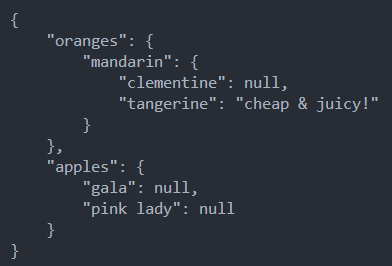
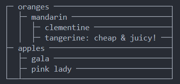
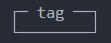

# 类图


## Json 图标类

图标类, 提供两种构造方式.

```c++
JsonIcon(const std::string& file_path);
JsonIcon(const std::string& leaf_icon, const std::string& container_icon);
```

在这里仅使用第一种, 从配置文件读取. 配置文件包括两行, 第一行是叶子节点的图标, 第二行是容器节点的图标. 例如:



由于图标字符的长度不一定是一个字符(8 bit), 所以应该用字符串来存储. 可以使用 `getLeafIcon` 和 `getContainerIcon` 方法来获得叶子节点和容器节点的图标. 上述配置使得渲染的 json 树将如下图所例(叶子节点是黑桃, 容器节点是方块):



## Json 节点类

###### JsonNode

Json 文件节点的抽象基类, 由此派生出叶子节点和容器节点. 这样容器节点的子节点就可以使用一个 `JsonNode` 的指针数组来存储.

###### JsonContainer

Json 的容器节点, **键(key)** 是标识符, **值(value)** 是使用 `{}` 括起来的内容. 由于 Json 的最外层是一个 `{}`, 在这里认为是一个键为空的容器节点.

###### JsonLeaf

Json 的叶子节点, 键和值都是 **标识符(identifier)**, 值可以是 "null" 字符串. 当值为 "null" 时, 值将不会被渲染.

## Json 解析器

JsonLoader 完成 json 文件的解析与存储. 内部是一个 JsonContainer 的指针. 该指针指向的 JsonContainer 即为最外层的键为空的容器节点.

在 `int load(const std::string& path);` 函数中完成对 json 文件的解析, 一共分为 3 步:
1. 清空 loader 的内容, 因为 loader 可能不是第一次 load 文件
2. 读入 json 文件的所有内容, 得到一个字符串
3. 解析第 2 步得到的字符串, 建立一棵树

由于前两步非常简单, 代码也很明确, 不再赘述, 接下来阐述第 3 步的实现方法. 

第三步主要包括两个函数 `parseContainer` 和 `parseLeaf`, 分别完成对容器的解析和对叶子节点的解析, 所以这将会是一个递归的过程. 需要注意的是, 在第 2 步中读入的文件内容包括空格和换行等空白字符串, 所以我首先定义了一个跳过空白字符串的函数 `skipSpace`.

`parseContainer` 完成解析从 `{` 到 `}` 之间的内容(包括花括号), 在代码中分别检查花括号的正确闭合, 键值的正确性, ':'的正确性以及内容的正确性, 对于内容的正确性将递归的向下进行.

1. 检查 `{` 的存在, 如果当前字符不是 `{` 将抛出异常
2. 检查键, 键必须是一个标识符, 如果不是标识符, 将会抛出异常. 在检查键之前应该先跳过空白字符, 所以在执行 `getIdentifier` 时, 当前字符一定在左引号或者标识符的第一个字符处.
```c++
if (skipSpace(input_file, now_pos))
{
    throw JsonLoaderException("error: JsonLoader::parseContainer missing right \'}\'\n");
}
std::string key = getIdentifier(input_file, now_pos);
```
3. 检查 `:`, 同样的跳过空白字符后, 当前字符应该处于 `:` 处, 如果不是, 需要抛出异常. 如果正确, 当前字符向后移动继续解析.
```c++
if (skipSpace(input_file, now_pos) || input_file[now_pos] != ':')
{
    throw JsonLoaderException("error: JsonLoader::parseContainer missing \':\' after key\n");
}
now_pos += 1;
```
4. 解析内容, 这里首先跳过空白字符. 当前位置必定是一个标识符(叶子节点)或者左花括号(容器节点), 如果是花括号, 将递归的执行 `parseContainer`, 解析完成后为这个子节点设置名称并添加到自己的子节点数组中. 否则, 递归的执行 `parseLeaf` 解析一个叶子节点. 这里没有抛出异常的原因是因为标识符可能以任意字符起始, 所以不方便做判断, 但是如果这里有问题, 一定会在后续的解析中检查出来.
```c++
if (skipSpace(input_file, now_pos))
{
    throw JsonLoaderException("error: JsonLoader::parseContainer missing value\n");
}
if (input_file[now_pos] == '{')
{
    std::shared_ptr<JsonContainer> child = parseContainer(input_file, now_pos, level + 1);
    child->setName(key);
    container->addChild(child);
}
else
{
    std::shared_ptr<JsonLeaf> child = parseLeaf(input_file, now_pos);
    child->setName(key);
    container->addChild(child);
}
```
5. 判断是否要继续下去, 如果接下来的非空字符是 `,`, 那么说明容器节点中还有其他子节点. 如果不是 `,`, 跳到第 7 步
```c++
if (skipSpace(input_file, now_pos))
{
    throw JsonLoaderException("error: JsonLoader::parseContainer missing right \'}\'\n");
}
if (input_file[now_pos] != ',') break;
now_pos += 1;
```
6. 返回到 2 继续执行
7. 检查右花括号, 即容器是否闭合, 如果没有闭合需要抛出异常. 如果闭合, new 一个容器节点并返回.

`parseLeaf` 将解析一个叶子节点的内容, 也就是一个标识符, 内容比较简单. 另外, 如果叶子节点的值还可能是数组的话, 在这里修改解析方式即可( JsonLeaf 的定义也要相应的改变, 增加对数组的支持)

```c++
std::shared_ptr<JsonLeaf> leaf = std::make_shared<JsonLeaf>();
std::string value = getIdentifier(input_file, now_pos);
leaf->setValue(value);
return leaf;
```

## Json 渲染器

`JsonRenderer` 主要是提供了两个抽象接口 `renderLeaf` 和 `renderContainer`, 这两个函数将在 Json 文件渲染时分别被 `JsonLeaf` 和 `JsonContainer` 的 `draw` 函数调用. 代码实现如下所示:

```c++
class JsonRenderer
{
protected:
    /* each string is one line */
    std::vector<std::string> m_outputBuffer;
public:
    JsonRenderer() = default;
    virtual void renderLeaf(JsonLeaf* leaf, int level) = 0;
    virtual void renderContainer(JsonContainer* container, int level) = 0;
    std::string getResult()
    {
        std::string result = "";
        for (auto& str : m_outputBuffer)
        {
            result += str;
            result += "\n";
        }
        return result;
    }
    virtual ~JsonRenderer() {};
};
```

需要注意的是, 这里定义了一个字符串数组 `m_outputBuffer`, 用来存储渲染过程中的中间结果, 因为对于一些风格可能需要在渲染后进行一些后处理, 比如矩形渲染(`RectRenderer`). 另外定义一个 `getResult` 函数将用于得到渲染的最终结果, 且行尾的换行符在此处添加. 因此在渲染函数 `renderLeaf` 和 `renderContainer` 中, 换行将会是 `m_outputBuffer.push_back("");`.

由 `JsonRenderer` 派生出 `OriginRenderer`, `RectRenderer` 和 `TreeRenderer`, 这是三种不同的风格(style), 各自实现 `renderLeaf` 和 `renderContainer` 接口, 下面依次说明.

###### OriginRenderer

原始版本的渲染风格, 即将 JsonLoader 载入的 json 文件渲染回 json 文件的格式, 这可以用于 json 文件的导出或者格式化(该方法渲染的 json 文件符合 vscode 格式化的 json 文件格式).

例如:



###### RectRenderer

矩形渲染风格, 将 Json 文件渲染为一个矩形. 例如:



对于单个标签的 Json 文件

```json
{
    "tag": null
}
```

渲染结果如下:



###### TreeRenderer

树形渲染风格, 将 Json 文件渲染为一棵树. 例如:


# 设计模式

###### 组合模式

`JsonNode` 派生 `JsonContainer` 和 `JsonLeaf`. `JsonContainer` 的子节点使用一个 `JsonNode` 的指针数组, 所以容器节点的子节点将可以是任何由 `JsonNode` 派生的对象. 这样做以后, 使得程序很好的契合 Json 文件的定义, 同时也方便扩展添加新的节点.

例如, 我现在要添加一个数组叶子节点, 其存放的内容是一个数组. 那么我就可以定义 `JsonArray` 继承 `JsonNode`, 然后实现一个渲染方法. 同时修改 `JsonContainer` 的解析函数中的分支情况, 增加一个对于数组的判断即可.

###### 工厂方法

对于 Json 渲染器, 应用工厂方法. 工厂的基类如下所示:

```c++
class RendererFactory {
protected:
    JsonIcon* m_icon;
public:
    RendererFactory(const std::string& icon_file = "") :m_icon(nullptr)
    {
        if (icon_file != "")
        {
            m_icon = new JsonIcon(icon_file);
        }
    }
    virtual JsonRenderer* create() = 0;
    virtual ~RendererFactory()
    {
        if (m_icon != nullptr) delete m_icon;
    };
};
```

其中, 构造函数的输入参数为一个字符串, 代表渲染使用的图标配置文件. 默认为空串, 即不使用图标(例如原始风格). 定义接口 `create` 用于构造一个渲染器, 这将由派生类各自实现.

在 `JsonLoader` 的  `draw` 方法中使用这个工厂来构造一个渲染器, 得到 Json 的渲染结果. 具体使用的渲染器将由传入的工厂决定.

```c++
std::string JsonLoader::draw(RendererFactory* factory)
{
    if (factory == nullptr || m_root == nullptr) return "";
    JsonRenderer* renderer = factory->create();
    renderer->renderContainer(m_root.get(), 0);
    std::string result = renderer->getResult();
    delete renderer;
    return result;
}
```

在主函数中, 定义多种工厂, 然后分别按照不同的风格渲染输出结果:

```c++
TreeRendererFactory tree_factory;
RectRendererFactory rect_factory;
OriginRendererFactory origin_factory;

std::string result = loader.draw(&tree_factory);
std::cout << result << std::endl;

result = loader.draw(&rect_factory);
std::cout << result << std::endl;

result = loader.draw(&origin_factory);
std::cout << result << std::endl;
```