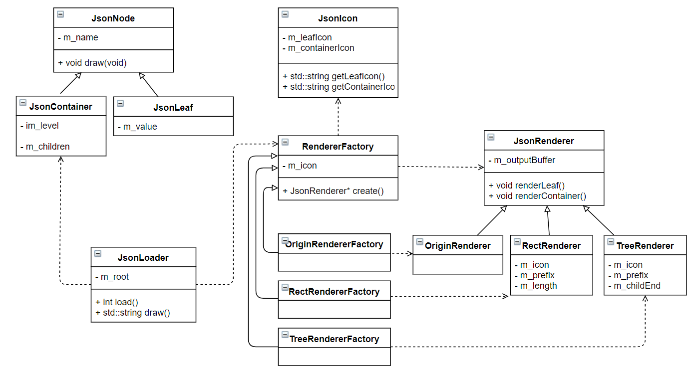

# 类图



# 设计模式

###### 组合模式

`JsonNode` 派生 `JsonContainer` 和 `JsonLeaf`. `JsonContainer` 的子节点使用一个 `JsonNode` 的指针数组, 所以容器节点的子节点将可以是任何由 `JsonNode` 派生的对象. 这样做以后, 使得程序很好的契合 Json 文件的定义, 同时也方便扩展添加新的节点.

例如, 我现在要添加一个数组叶子节点, 其存放的内容是一个数组. 那么我就可以定义 `JsonArray` 继承 `JsonNode`, 然后实现一个渲染方法. 同时修改 `JsonContainer` 的解析函数中的分支情况, 增加一个对于数组的判断即可.

###### 工厂方法

对于 Json 渲染器, 应用工厂方法. 工厂的基类如下所示:

```c++
class RendererFactory {
protected:
    JsonIcon* m_icon;
public:
    RendererFactory(const std::string& icon_file = "") :m_icon(nullptr)
    {
        if (icon_file != "")
        {
            m_icon = new JsonIcon(icon_file);
        }
    }
    virtual JsonRenderer* create() = 0;
    virtual ~RendererFactory()
    {
        if (m_icon != nullptr) delete m_icon;
    };
};
```

其中, 构造函数的输入参数为一个字符串, 代表渲染使用的图标配置文件. 默认为空串, 即不使用图标(例如原始风格). 定义接口 `create` 用于构造一个渲染器, 这将由派生类各自实现.

在 `JsonLoader` 的  `draw` 方法中使用这个工厂来构造一个渲染器, 得到 Json 的渲染结果. 具体使用的渲染器将由传入的工厂决定.

```c++
std::string JsonLoader::draw(RendererFactory* factory)
{
    if (factory == nullptr || m_root == nullptr) return "";
    JsonRenderer* renderer = factory->create();
    renderer->render(JsonContainer*)(m_root.get(), 0);
    std::string result = renderer->getResult();
    delete renderer;
    return result;
}
```

定义多种工厂, 然后分别按照不同的风格渲染输出结果:

```c++
TreeRendererFactory tree_factory;
RectRendererFactory rect_factory;
OriginRendererFactory origin_factory;

std::string result = loader.draw(&tree_factory);
std::cout << result << std::endl;

result = loader.draw(&rect_factory);
std::cout << result << std::endl;

result = loader.draw(&origin_factory);
std::cout << result << std::endl;
```

###### 访问者模式

在访问者 `JsonRenderer` 中实现两个重载的render方法, 对应两种类型的 Json 节点, 其中实现对应的渲染方式:

```c++
virtual void render(JsonLeaf* leaf, int level) = 0;
virtual void render(JsonContainer* container, int level) = 0;
```

在 JsonNode (抽象基类) 中提供接口, `virtual  void draw(JsonRenderer* renderer, int level) override;`. 它接收一个访问者 `JsonRenderer` 完成对应风格的绘制. 具体调用示例如下:

```c++
void JsonLeaf::draw(JsonRenderer* renderer, int level)
{
    renderer->render(this, level);
}
```

###### 迭代器模式

定义一个迭代器基类, 由此派生出 `JsonLeafIterator` 和 `JsonContainerIterator`

```c++
class JsonIterator {
protected:
    int m_idx;
    JsonNode* m_node;
public:
    JsonIterator(JsonNode* node, int i);
    virtual bool hasMore() = 0;
    // 最后一个元素后一个
    virtual bool atEnd() = 0;
    // 最后一个元素
    virtual bool atLast() = 0;
    virtual void getNext() = 0;
    virtual JsonNode* get() = 0;
    virtual ~JsonIterator() {}
};
```

应用举例:

在 `RectRenderer` 中应用迭代器遍历容器的所有子节点进行渲染

```c++
for (auto iter = container->begin();!iter->atEnd();iter->getNext())
{
    if (iter->atLast())
    {
        // m_prefix = m_prefix.substr(0, (level - 1) * 3) + "|  ";
        shrinkPrefix(level);
        m_prefix.push_back("└─ ");
        m_childEnd = true;
    }
    else
    {
        // m_prefix = m_prefix.substr(0, (level - 1) * 3) + "|  ";
        shrinkPrefix(level);
        m_prefix.push_back("├─ ");
    }
    if (!m_outputBuffer.empty()) m_outputBuffer.back() += getPrefix();
    else m_outputBuffer.push_back(getPrefix());
    iter->get()->draw(this, level + 1);
}
```